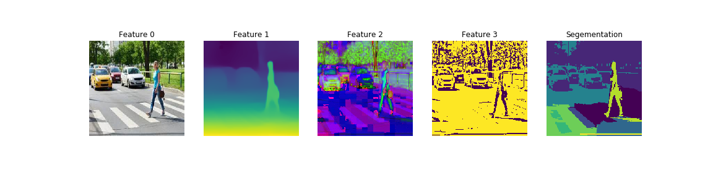

<h1>Unsupervised image segmentation</h1>

This code generates unsupervised image segmentation through manifold learning applied to multiple image transformations as features. 
The key strengths of this code lie in the model's explainability, transparency, and simplicity. However, it is essential to carefully tune the parameters to adapt the method to the specific domain of the dataset and its variability. Once this adjustment is successfully performed, impressive results can be obtained : 

<h4>Examples</h4>

## Requirements

python3, scikit-learn, opencv2, scikit-image, transformers

## Getting started

    $ python tools/segmentation.py --input '../images/101027.jpg'
